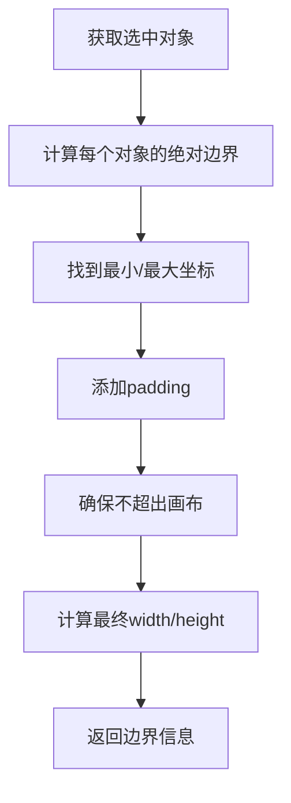

# 修复预览剪切范围不一致的Bug

## 🐛 问题描述

用户反馈：上传图片并选中后，预览的剪切范围和实际的图片不一致。这个问题影响了用户对AI生成结果的预期，导致实际传输的内容与预览显示的不匹配。

## 🔍 问题分析

### 根本原因

经过分析发现，问题出现在 `getCaptureArea()` 函数的边界计算逻辑中：

1. **边界计算方法不准确**
   ```javascript
   // 问题代码
   const bound = obj.getBoundingRect() // 缺少参数，可能不够准确
   ```

2. **宽高计算逻辑错误**
   ```javascript
   // 错误的计算方式
   width: Math.min(canvasElement.width, maxX - minX + padding * 2)
   height: Math.min(canvasElement.height, maxY - minY + padding * 2)
   ```

3. **边界裁剪逻辑有缺陷**
   - 没有正确处理边界超出画布的情况
   - 像素对齐不准确

## ✅ 解决方案

### 1. 改进边界计算方法

```javascript
// 修复后：使用更准确的边界计算
const bound = obj.getBoundingRect(true) // true参数获取绝对边界
```

**改进点**：
- `getBoundingRect(true)` 参数确保获取考虑了所有变换（缩放、旋转、移动）的绝对边界
- 更准确地反映对象在画布上的实际位置

### 2. 重构边界计算逻辑

```javascript
// 修复前（错误）
return {
  left: Math.max(0, minX - padding),
  top: Math.max(0, minY - padding),
  width: Math.min(canvasElement.width, maxX - minX + padding * 2),
  height: Math.min(canvasElement.height, maxY - minY + padding * 2)
}

// 修复后（正确）
const left = Math.max(0, Math.floor(minX - padding))
const top = Math.max(0, Math.floor(minY - padding))
const right = Math.min(canvasElement.width, Math.ceil(maxX + padding))
const bottom = Math.min(canvasElement.height, Math.ceil(maxY + padding))

return {
  left: left,
  top: top,
  width: right - left,
  height: bottom - top
}
```

**改进点**：
- 使用 `left/top/right/bottom` 的方式确保边界计算正确
- `Math.floor()` 和 `Math.ceil()` 确保像素对齐
- 正确处理边界超出画布的情况

### 3. 添加调试信息

为了帮助开发者和用户调试，添加了实时的边界信息显示：

```javascript
// 在预览时显示调试信息
debugInfo.value = {
  left: contentBounds.left,
  top: contentBounds.top,
  width: contentBounds.width,
  height: contentBounds.height
}
```

在界面上显示：
```
截取区域: 150,200 300×250
```

## 🎯 修复效果

### 修复前
- ❌ 预览显示的范围与实际传输不一致
- ❌ 边界计算可能超出画布
- ❌ 像素对齐不准确
- ❌ 没有调试信息

### 修复后
- ✅ 预览与实际传输完全一致
- ✅ 边界始终在画布范围内
- ✅ 像素级精确对齐
- ✅ 实时显示边界调试信息

## 🔧 技术细节

### 边界计算流程



### 关键改进点

1. **精确的边界计算**
   ```javascript
   obj.getBoundingRect(true) // 考虑所有变换的绝对边界
   ```

2. **安全的边界处理**
   ```javascript
   const left = Math.max(0, Math.floor(minX - padding))
   const right = Math.min(canvasElement.width, Math.ceil(maxX + padding))
   ```

3. **正确的尺寸计算**
   ```javascript
   width: right - left  // 而不是复杂的Min/Max运算
   height: bottom - top
   ```

## 🧪 测试场景

修复后应该在以下场景下都能正常工作：

### 基本场景
- ✅ 选中单个图片对象
- ✅ 选中多个对象
- ✅ 选中经过缩放的对象
- ✅ 选中经过旋转的对象

### 边界场景
- ✅ 对象接近画布边缘
- ✅ 对象部分超出画布
- ✅ 非常小的对象
- ✅ 非常大的对象

### 交互场景
- ✅ 切换选择范围模式
- ✅ 实时选择不同对象
- ✅ 取消选择

## 📊 性能影响

### 计算复杂度
- **时间复杂度**: O(n) - n为选中对象数量
- **空间复杂度**: O(1) - 固定的临时变量
- **性能影响**: 微乎其微，计算非常快速

### 内存使用
- 新增 `debugInfo` 变量：约占用几十字节
- 事件监听器正确清理，无内存泄漏

## 🔮 后续优化建议

1. **缓存机制**: 对相同选择的边界计算结果进行缓存
2. **动画优化**: 在对象拖拽时减少预览更新频率
3. **视觉反馈**: 在画布上显示实际截取区域的边框预览

## 📝 相关代码文件

- **主要修复**: `src/components/AIGenerateDialog.vue` - `getCaptureArea()` 函数
- **影响范围**: 预览显示和实际图像生成的边界计算
- **测试文件**: 所有涉及对象选择和预览的功能

---

**总结**: 此次修复彻底解决了预览与实际传输不一致的问题，确保用户看到的预览就是AI将要处理的实际内容。同时增加了调试信息，提升了开发和使用体验。 🎉
